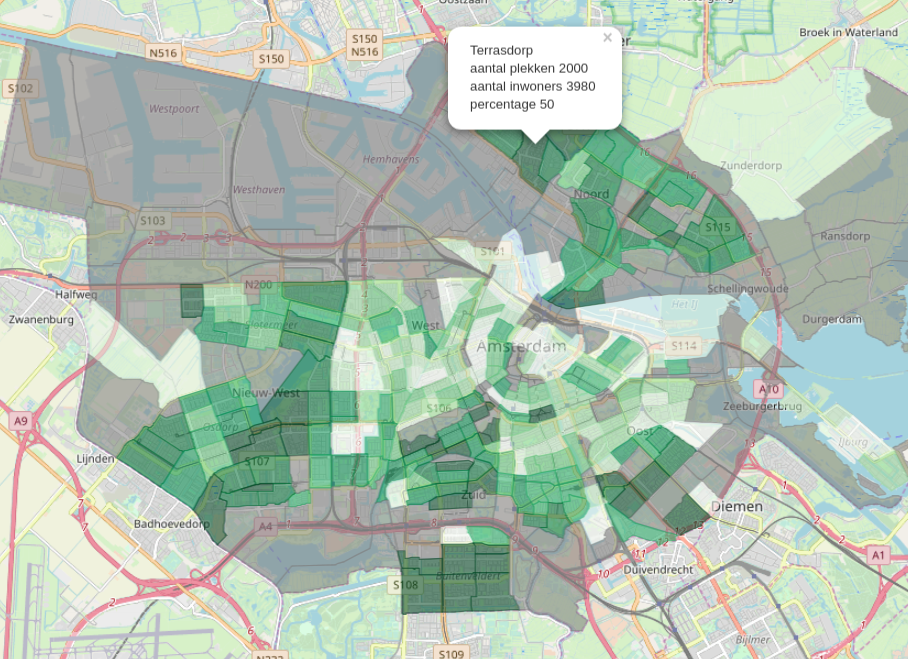

# CBS_shapes

CBS data in shapefiles, combined with Amsterdam parking data. Data set with parking spots in Amsterdam can be downloaded from [here](https://data.amsterdam.nl/#?dte=dcatd%2Fdatasets%2Fspeciale-parkeerplaatsen&dtfs=T&dsf=groups::verkeer-infrastructuur&mpb=topografie&mpz=11&mpv=52.3731081:4.8932945).

The interactive leaflet of parking percentages of Amsterdam can be see [here](https://longhowlam.github.io/adampark.html).

